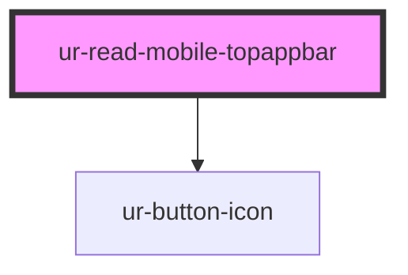

# ur-read-mobile-topappbar

<!-- Auto Generated Below -->

## Properties

| Property          | Attribute          | Description | Type                              | Default     |
| ----------------- | ------------------ | ----------- | --------------------------------- | ----------- |
| `headerTitle`     | `header-title`     |             | `string`                          | `undefined` |
| `scrollBehavior`  | `scroll-behavior`  |             | `"elevate" \| "hide" \| "shrink"` | `'hide'`    |
| `scrollThreshold` | `scroll-threshold` |             | `number`                          | `30`        |
| `variant`         | `variant`          |             | `string`                          | `'small'`   |

## Events

| Event                  | Description | Type                |
| ---------------------- | ----------- | ------------------- |
| `backClick`            |             | `CustomEvent<void>` |
| `chaptersClick`        |             | `CustomEvent<void>` |
| `readingSettingsClick` |             | `CustomEvent<void>` |

## Dependencies

### Depends on

- [ur-button-icon](../../ur-button-icon)

### Graph

----------------------------------------------

*Built with [StencilJS](https://stenciljs.com/)*
