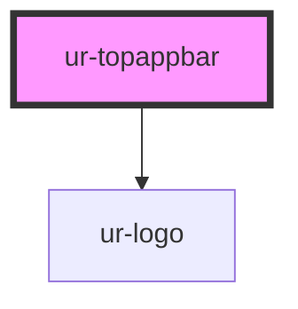

# ur-topappbar

<!-- Auto Generated Below -->

## Properties

| Property          | Attribute          | Description | Type                              | Default           |
| ----------------- | ------------------ | ----------- | --------------------------------- | ----------------- |
| `headerTitle`     | `header-title`     |             | `string`                          | `'Default Title'` |
| `logoOpacity`     | `logo-opacity`     |             | `number`                          | `1`               |
| `logoRotation`    | `logo-rotation`    |             | `number`                          | `0`               |
| `scrollBehavior`  | `scroll-behavior`  |             | `"elevate" \| "hide" \| "shrink"` | `undefined`       |
| `scrollThreshold` | `scroll-threshold` |             | `number`                          | `30`              |
| `variant`         | `variant`          |             | `string`                          | `'small'`         |

## Dependencies

### Depends on

- [ur-logo](../../ur-logo)

### Graph

----------------------------------------------

*Built with [StencilJS](https://stenciljs.com/)*
