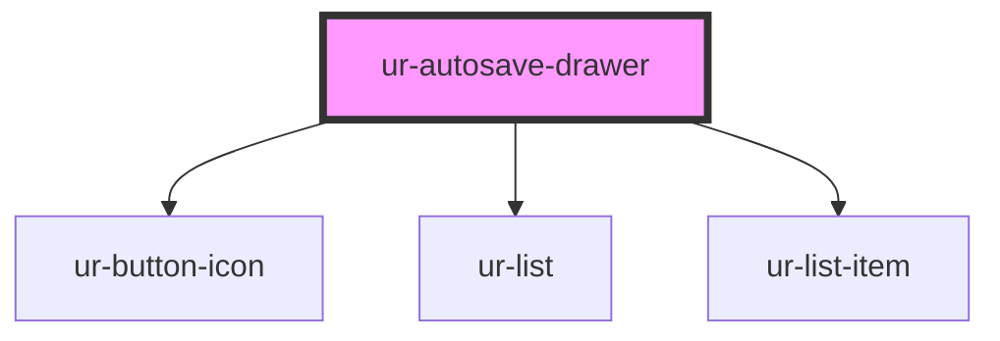

# ur-autosave-drawer

<!-- Auto Generated Below -->

## Properties

| Property               | Attribute                | Description                                      | Type     | Default                                                |
| ---------------------- | ------------------------ | ------------------------------------------------ | -------- | ------------------------------------------------------ |
| `autosaves`            | `autosaves`              | Array of autosave items to display in the drawer | `any[]`  | `[]`                                                   |
| `autosavesTitle`       | `autosaves-title`        | Text for the autosaves title                     | `string` | `'Autosaves'`                                          |
| `chapterText`          | `chapter-text`           | Text for the chapter label                       | `string` | `'Chapter'`                                            |
| `deleteConfirmMessage` | `delete-confirm-message` | Text for delete confirmation                     | `string` | `'Delete chapter?'`                                    |
| `emptyMessage`         | `empty-message`          | Empty drawer message                             | `string` | `"You don't have anything saved in your drawer, yet!"` |
| `noText`               | `no-text`                | Text for the no button                           | `string` | `'No'`                                                 |
| `yesText`              | `yes-text`               | Text for the yes button                          | `string` | `'Yes'`                                                |

## Events

| Event                   | Description                                                    | Type               |
| ----------------------- | -------------------------------------------------------------- | ------------------ |
| `autosaveDeleteCancel`  | Event emitted when delete confirmation "No" button is clicked  | `CustomEvent<any>` |
| `autosaveDeleteConfirm` | Event emitted when delete confirmation "Yes" button is clicked | `CustomEvent<any>` |
| `autosaveDeleteRequest` | Event emitted when delete icon is clicked for an autosave      | `CustomEvent<any>` |
| `autosaveOpen`          | Event emitted when an autosave is selected to open             | `CustomEvent<any>` |

## Dependencies

### Depends on

- [ur-button-icon](../ur-button-icon)
- [ur-list](../ur-list)
- [ur-list-item](../ur-list-item)

### Graph

----------------------------------------------

*Built with [StencilJS](https://stenciljs.com/)*
