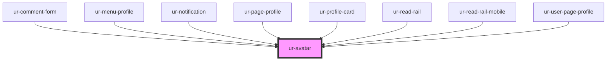

# ur-avatar

<!-- Auto Generated Below -->

## Properties

| Property  | Attribute | Description | Type               | Default     |
| --------- | --------- | ----------- | ------------------ | ----------- |
| `border`  | `border`  |             | `string`           | `'0'`       |
| `name`    | `name`    |             | `string`           | `undefined` |
| `radius`  | `radius`  |             | `string`           | `'50%'`     |
| `size`    | `size`    |             | `string`           | `'32px'`    |
| `src`     | `src`     |             | `string`           | `undefined` |
| `variant` | `variant` |             | `"page" \| "user"` | `'user'`    |

## Dependencies

### Used by

 - [ur-comment-form](../ur-comment-form)
 - [ur-menu-profile](../ur-menu-profile)
 - [ur-notification](../ur-notification)
 - [ur-page-profile](../ur-page-profile)
 - [ur-profile-card](../ur-profile-card)
 - [ur-read-rail](../ur-read-rail)
 - [ur-read-rail-mobile](../ur-read-rail-mobile)
 - [ur-user-page-profile](../ur-user-page-profile)

### Graph

----------------------------------------------

*Built with [StencilJS](https://stenciljs.com/)*
