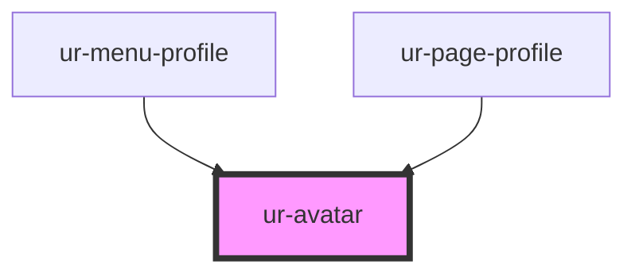

# ur-avatar

<!-- Auto Generated Below -->

## Properties

| Property | Attribute | Description | Type     | Default     |
| -------- | --------- | ----------- | -------- | ----------- |
| `border` | `border`  |             | `string` | `'0'`       |
| `name`   | `name`    |             | `string` | `undefined` |
| `radius` | `radius`  |             | `string` | `'50%'`     |
| `size`   | `size`    |             | `string` | `'32px'`    |
| `src`    | `src`     |             | `string` | `undefined` |

## Dependencies

### Used by

 - [ur-menu-profile](../ur-menu-profile)
 - [ur-page-profile](../ur-page-profile)

### Graph

----------------------------------------------

*Built with [StencilJS](https://stenciljs.com/)*
