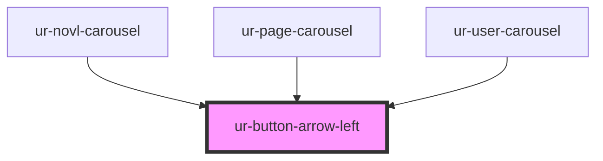

# ur-button-arrow-left

<!-- Auto Generated Below -->

## Properties

| Property   | Attribute  | Description | Type      | Default |
| ---------- | ---------- | ----------- | --------- | ------- |
| `disabled` | `disabled` |             | `boolean` | `false` |

## Events

| Event         | Description | Type               |
| ------------- | ----------- | ------------------ |
| `leftClicked` |             | `CustomEvent<any>` |

## Dependencies

### Used by

 - [ur-novl-carousel](../ur-novl-carousel)
 - [ur-page-carousel](../ur-page-carousel)
 - [ur-user-carousel](../ur-user-carousel)

### Graph

----------------------------------------------

*Built with [StencilJS](https://stenciljs.com/)*
