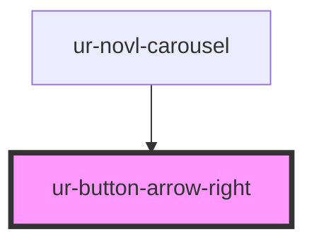

# ur-button-arrow-right

<!-- Auto Generated Below -->

## Properties

| Property   | Attribute  | Description | Type      | Default |
| ---------- | ---------- | ----------- | --------- | ------- |
| `disabled` | `disabled` |             | `boolean` | `false` |

## Events

| Event          | Description | Type               |
| -------------- | ----------- | ------------------ |
| `rightClicked` |             | `CustomEvent<any>` |

## Dependencies

### Used by

 - [ur-novl-carousel](../ur-novl-carousel)

### Graph

----------------------------------------------

*Built with [StencilJS](https://stenciljs.com/)*
