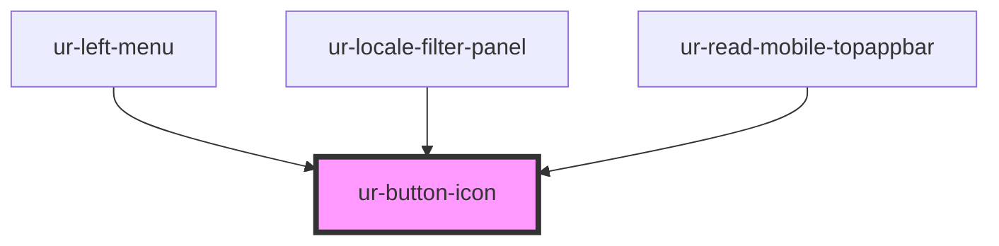

# ur-button-icon

<!-- Auto Generated Below -->

## Properties

| Property       | Attribute       | Description | Type                                              | Default             |
| -------------- | --------------- | ----------- | ------------------------------------------------- | ------------------- |
| `disabled`     | `disabled`      |             | `boolean`                                         | `false`             |
| `icon`         | `icon`          |             | `string`                                          | `'favorite_border'` |
| `loading`      | `loading`       |             | `boolean`                                         | `false`             |
| `selected`     | `selected`      |             | `boolean`                                         | `false`             |
| `selectedIcon` | `selected-icon` |             | `string`                                          | `'favorite'`        |
| `variant`      | `variant`       |             | `"filled" \| "outlined" \| "standard" \| "tonal"` | `'standard'`        |

## Dependencies

### Used by

 - [ur-left-menu](../ur-menu)
 - [ur-locale-filter-panel](../ur-locale-filter-panel)
 - [ur-read-mobile-topappbar](../topappbars/read-mobile-topappbar)

### Graph

----------------------------------------------

*Built with [StencilJS](https://stenciljs.com/)*
