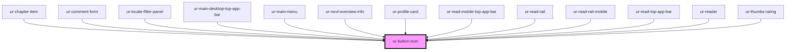

# ur-button-icon

<!-- Auto Generated Below -->

## Properties

| Property          | Attribute          | Description | Type                                              | Default             |
| ----------------- | ------------------ | ----------- | ------------------------------------------------- | ------------------- |
| `active`          | `active`           |             | `boolean`                                         | `false`             |
| `backgroundColor` | `background-color` |             | `string`                                          | `undefined`         |
| `borderRadius`    | `border-radius`    |             | `string`                                          | `'8px'`             |
| `buttonHeight`    | `button-height`    |             | `string`                                          | `'40px'`            |
| `buttonWidth`     | `button-width`     |             | `string`                                          | `'40px'`            |
| `disabled`        | `disabled`         |             | `boolean`                                         | `false`             |
| `fontColor`       | `font-color`       |             | `string`                                          | `undefined`         |
| `icon`            | `icon`             |             | `string`                                          | `'favorite_border'` |
| `loading`         | `loading`          |             | `boolean`                                         | `false`             |
| `selected`        | `selected`         |             | `boolean`                                         | `false`             |
| `selectedIcon`    | `selected-icon`    |             | `string`                                          | `undefined`         |
| `variant`         | `variant`          |             | `"filled" \| "outlined" \| "standard" \| "tonal"` | `'standard'`        |

## Dependencies

### Used by

 - [ur-chapter-item](../ur-chapter-item)
 - [ur-comment-form](../ur-comment-form)
 - [ur-locale-filter-panel](../ur-locale-filter-panel)
 - [ur-main-desktop-top-app-bar](../ur-main-desktop-top-app-bar)
 - [ur-main-menu](../ur-main-menu)
 - [ur-novl-overview-info](../ur-novl-overview-info)
 - [ur-profile-card](../ur-profile-card)
 - [ur-read-mobile-top-app-bar](../ur-read-mobile-top-app-bar)
 - [ur-read-rail](../ur-read-rail)
 - [ur-read-rail-mobile](../ur-read-rail-mobile)
 - [ur-read-top-app-bar](../ur-read-top-app-bar)
 - [ur-reader](../ur-reader)
 - [ur-thumbs-rating](../ur-thumbs-rating)

### Graph

----------------------------------------------

*Built with [StencilJS](https://stenciljs.com/)*
