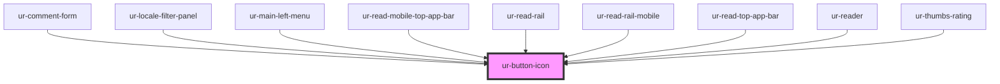

# ur-button-icon

<!-- Auto Generated Below -->

## Properties

| Property       | Attribute       | Description | Type                                              | Default             |
| -------------- | --------------- | ----------- | ------------------------------------------------- | ------------------- |
| `disabled`     | `disabled`      |             | `boolean`                                         | `false`             |
| `icon`         | `icon`          |             | `string`                                          | `'favorite_border'` |
| `loading`      | `loading`       |             | `boolean`                                         | `false`             |
| `selected`     | `selected`      |             | `boolean`                                         | `false`             |
| `selectedIcon` | `selected-icon` |             | `string`                                          | `undefined`         |
| `variant`      | `variant`       |             | `"filled" \| "outlined" \| "standard" \| "tonal"` | `'standard'`        |

## Dependencies

### Used by

 - [ur-comment-form](../ur-comment-form)
 - [ur-locale-filter-panel](../ur-locale-filter-panel)
 - [ur-main-left-menu](../ur-main-left-menu)
 - [ur-read-mobile-top-app-bar](../ur-read-mobile-top-app-bar)
 - [ur-read-rail](../ur-read-rail)
 - [ur-read-rail-mobile](../ur-read-rail-mobile)
 - [ur-read-top-app-bar](../ur-read-top-app-bar)
 - [ur-reader](../ur-reader)
 - [ur-thumbs-rating](../ur-thumbs-rating)

### Graph

----------------------------------------------

*Built with [StencilJS](https://stenciljs.com/)*
