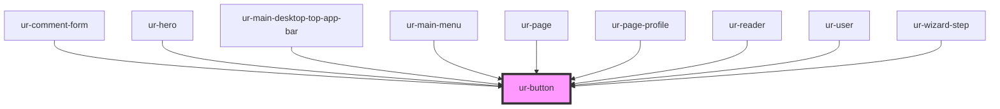

# ur-button

<!-- Auto Generated Below -->

## Properties

<<<<<<< HEAD
| Property       | Attribute       | Description | Type                                                        | Default     |
| -------------- | --------------- | ----------- | ----------------------------------------------------------- | ----------- |
| `borderRadius` | `border-radius` |             | `string`                                                    | `'8px'`     |
| `buttonHeight` | `button-height` |             | `string`                                                    | `undefined` |
| `disabled`     | `disabled`      |             | `boolean`                                                   | `false`     |
| `endIcon`      | `end-icon`      |             | `any`                                                       | `null`      |
| `fontColor`    | `font-color`    |             | `string`                                                    | `undefined` |
| `fullWidth`    | `full-width`    |             | `boolean`                                                   | `undefined` |
| `icon`         | `icon`          |             | `any`                                                       | `null`      |
| `loading`      | `loading`       |             | `boolean`                                                   | `false`     |
| `variant`      | `variant`       |             | `"elevated" \| "filled" \| "outlined" \| "text" \| "tonal"` | `'filled'`  |
=======
| Property    | Attribute    | Description | Type                                                        | Default     |
| ----------- | ------------ | ----------- | ----------------------------------------------------------- | ----------- |
| `disabled`  | `disabled`   |             | `boolean`                                                   | `false`     |
| `endIcon`   | `end-icon`   |             | `any`                                                       | `null`      |
| `fullWidth` | `full-width` |             | `boolean`                                                   | `undefined` |
| `icon`      | `icon`       |             | `any`                                                       | `null`      |
| `loading`   | `loading`    |             | `boolean`                                                   | `false`     |
| `variant`   | `variant`    |             | `"elevated" \| "filled" \| "outlined" \| "text" \| "tonal"` | `'filled'`  |
>>>>>>> origin/master

## Dependencies

### Used by

 - [ur-comment-form](../ur-comment-form)
 - [ur-hero](../ur-hero)
 - [ur-main-desktop-top-app-bar](../ur-main-desktop-top-app-bar)
 - [ur-main-menu](../ur-main-menu)
 - [ur-page](../ur-page)
 - [ur-page-profile](../ur-page-profile)
 - [ur-reader](../ur-reader)
 - [ur-user](../ur-user)
 - [ur-wizard-step](../ur-wizard-step)

### Graph

----------------------------------------------

*Built with [StencilJS](https://stenciljs.com/)*
