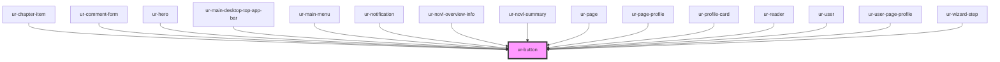

# ur-button

<!-- Auto Generated Below -->

## Properties

| Property          | Attribute          | Description | Type                                                        | Default     |
| ----------------- | ------------------ | ----------- | ----------------------------------------------------------- | ----------- |
| `backgroundColor` | `background-color` |             | `string`                                                    | `undefined` |
| `borderRadius`    | `border-radius`    |             | `string`                                                    | `'8px'`     |
| `buttonHeight`    | `button-height`    |             | `string`                                                    | `undefined` |
| `disabled`        | `disabled`         |             | `boolean`                                                   | `false`     |
| `endIcon`         | `end-icon`         |             | `any`                                                       | `null`      |
| `fontColor`       | `font-color`       |             | `string`                                                    | `undefined` |
| `fullWidth`       | `full-width`       |             | `boolean`                                                   | `undefined` |
| `icon`            | `icon`             |             | `any`                                                       | `null`      |
| `loading`         | `loading`          |             | `boolean`                                                   | `false`     |
| `variant`         | `variant`          |             | `"elevated" \| "filled" \| "outlined" \| "text" \| "tonal"` | `'filled'`  |

## Dependencies

### Used by

 - [ur-chapter-item](../ur-chapter-item)
 - [ur-comment-form](../ur-comment-form)
 - [ur-hero](../ur-hero)
 - [ur-main-desktop-top-app-bar](../ur-main-desktop-top-app-bar)
 - [ur-main-menu](../ur-main-menu)
 - [ur-notification](../ur-notification)
 - [ur-novl-overview-info](../ur-novl-overview-info)
 - [ur-novl-summary](../ur-novl-summary)
 - [ur-page](../ur-page)
 - [ur-page-profile](../ur-page-profile)
 - [ur-profile-card](../ur-profile-card)
 - [ur-reader](../ur-reader)
 - [ur-user](../ur-user)
 - [ur-user-page-profile](../ur-user-page-profile)
 - [ur-wizard-step](../ur-wizard-step)

### Graph

----------------------------------------------

*Built with [StencilJS](https://stenciljs.com/)*
