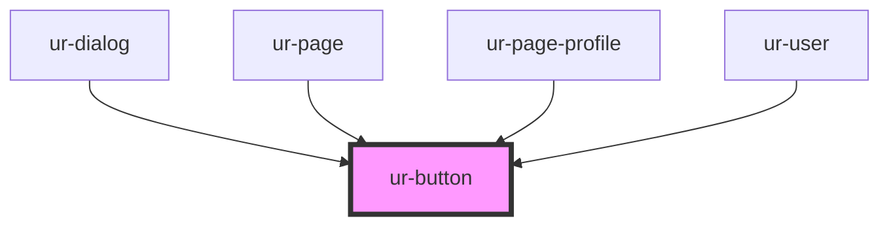

# ur-button

<!-- Auto Generated Below -->

## Properties

| Property   | Attribute  | Description | Type                                                        | Default    |
| ---------- | ---------- | ----------- | ----------------------------------------------------------- | ---------- |
| `disabled` | `disabled` |             | `boolean`                                                   | `false`    |
| `endIcon`  | `end-icon` |             | `any`                                                       | `null`     |
| `icon`     | `icon`     |             | `any`                                                       | `null`     |
| `variant`  | `variant`  |             | `"elevated" \| "filled" \| "outlined" \| "text" \| "tonal"` | `'filled'` |

## Dependencies

### Used by

 - [ur-dialog](../ur-dialog)
 - [ur-page](../ur-page)
 - [ur-page-profile](../ur-page-profile)
 - [ur-user](../ur-user)

### Graph

----------------------------------------------

*Built with [StencilJS](https://stenciljs.com/)*
