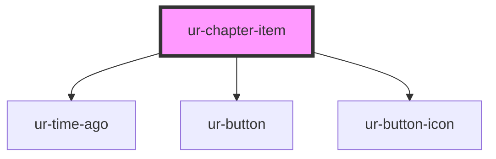

# ur-chapter-item

<!-- Auto Generated Below -->

## Properties

| Property              | Attribute               | Description | Type      | Default              |
| --------------------- | ----------------------- | ----------- | --------- | -------------------- |
| `chapterId`           | `chapter-id`            |             | `string`  | `undefined`          |
| `chapterNumber`       | `chapter-number`        |             | `number`  | `undefined`          |
| `chapterTitle`        | `chapter-title`         |             | `string`  | `undefined`          |
| `createdAt`           | `created-at`            |             | `string`  | `undefined`          |
| `isBound`             | `is-bound`              |             | `boolean` | `false`              |
| `isLocked`            | `is-locked`             |             | `boolean` | `false`              |
| `isOwner`             | `is-owner`              |             | `boolean` | `false`              |
| `isStoryCompleted`    | `is-story-completed`    |             | `boolean` | `false`              |
| `likes`               | `likes`                 |             | `number`  | `0`                  |
| `likesText`           | `likes-text`            |             | `string`  | `'Likes'`            |
| `readChapterText`     | `read-chapter-text`     |             | `string`  | `'Read'`             |
| `readingDuration`     | `reading-duration`      |             | `number`  | `0`                  |
| `readingDurationText` | `reading-duration-text` |             | `string`  | `'Reading Duration'` |
| `views`               | `views`                 |             | `number`  | `0`                  |
| `viewsText`           | `views-text`            |             | `string`  | `'Views'`            |

## Events

| Event           | Description | Type                                                        |
| --------------- | ----------- | ----------------------------------------------------------- |
| `deleteChapter` |             | `CustomEvent<{ chapterId: string; chapterTitle: string; }>` |
| `readChapter`   |             | `CustomEvent<string>`                                       |

## Dependencies

### Depends on

- [ur-time-ago](../ur-time-ago)
- [ur-button](../ur-button)
- [ur-button-icon](../ur-button-icon)

### Graph

----------------------------------------------

*Built with [StencilJS](https://stenciljs.com/)*
