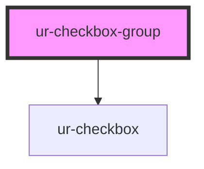

# ur-checkbox-group

<!-- Auto Generated Below -->

## Properties

| Property        | Attribute         | Description                          | Type       | Default           |
| --------------- | ----------------- | ------------------------------------ | ---------- | ----------------- |
| `maxSelectable` | `max-selectable`  | Maximum number of selectable options | `number`   | `null`            |
| `name`          | `name`            | The name of the checkbox group       | `string`   | `'default-group'` |
| `required`      | `required`        | Whether the group is required        | `boolean`  | `false`           |
| `selectAll`     | `select-all`      | Enable a "Select All" checkbox       | `boolean`  | `false`           |
| `selectAllText` | `select-all-text` | Text for the "Select All" checkbox   | `string`   | `'Select All'`    |
| `values`        | `values`          | Currently selected values            | `string[]` | `[]`              |

## Events

| Event               | Description                                 | Type                                                               |
| ------------------- | ------------------------------------------- | ------------------------------------------------------------------ |
| `errorStateChanged` | Event emitted when validation state changes | `CustomEvent<{ name: string; error: boolean; message?: string; }>` |
| `valueChanged`      | Event emitted when the values change        | `CustomEvent<{ name: string; values: string[]; }>`                 |

## Methods

### `reset() => Promise<void>`

Reset the checkbox group

#### Returns

Type: `Promise<void>`

### `validate() => Promise<boolean>`

Validate the checkbox group

#### Returns

Type: `Promise<boolean>`

## Dependencies

### Depends on

- [ur-checkbox](../ur-checkbox)

### Graph

----------------------------------------------

*Built with [StencilJS](https://stenciljs.com/)*
