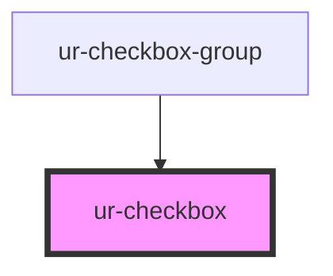

# ur-checkbox

<!-- Auto Generated Below -->

## Properties

| Property   | Attribute  | Description                           | Type      | Default |
| ---------- | ---------- | ------------------------------------- | --------- | ------- |
| `checked`  | `checked`  | Indicates if the checkbox is checked  | `boolean` | `false` |
| `disabled` | `disabled` | Indicates if the checkbox is disabled | `boolean` | `false` |
| `name`     | `name`     | The name of the checkbox group        | `string`  | `''`    |
| `value`    | `value`    | The value of the checkbox             | `string`  | `''`    |

## Events

| Event          | Description                                   | Type                                                              |
| -------------- | --------------------------------------------- | ----------------------------------------------------------------- |
| `valueChanged` | Event emitted when the checkbox value changes | `CustomEvent<{ name: string; value: string; checked: boolean; }>` |

## Dependencies

### Used by

 - [ur-checkbox-group](../ur-checkbox-group)

### Graph

----------------------------------------------

*Built with [StencilJS](https://stenciljs.com/)*
