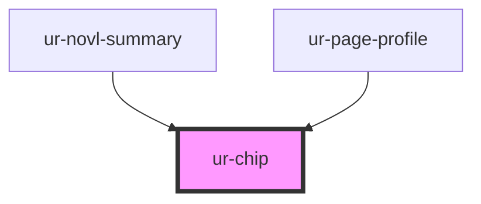

# ur-chip

<!-- Auto Generated Below -->

## Properties

| Property      | Attribute      | Description | Type      | Default                                               |
| ------------- | -------------- | ----------- | --------- | ----------------------------------------------------- |
| `backColor`   | `back-color`   |             | `string`  | `'rgb(var(--mdui-color-primary-container-light))'`    |
| `border`      | `border`       |             | `string`  | `'0'`                                                 |
| `borderColor` | `border-color` |             | `string`  | `'rgb(var(--ur-color-background))'`                   |
| `clickable`   | `clickable`    |             | `boolean` | `true`                                                |
| `disabled`    | `disabled`     |             | `boolean` | `false`                                               |
| `fontColor`   | `font-color`   |             | `string`  | `'rgb(var(--mdui-color-on-primary-container-light))'` |
| `label`       | `label`        |             | `string`  | `'Chip'`                                              |
| `loading`     | `loading`      |             | `boolean` | `false`                                               |
| `radius`      | `radius`       |             | `string`  | `'8px'`                                               |
| `size`        | `size`         |             | `string`  | `'32px'`                                              |

## Dependencies

### Used by

 - [ur-novl-summary](../ur-novl-summary)
 - [ur-page-profile](../ur-page-profile)

### Graph

----------------------------------------------

*Built with [StencilJS](https://stenciljs.com/)*
