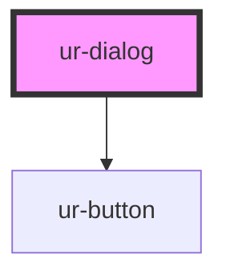

# ur-dialog

<!-- Auto Generated Below -->

## Properties

| Property              | Attribute                | Description | Type      | Default              |
| --------------------- | ------------------------ | ----------- | --------- | -------------------- |
| `closeOnEsc`          | `close-on-esc`           |             | `boolean` | `true`               |
| `closeOnOverlayClick` | `close-on-overlay-click` |             | `boolean` | `true`               |
| `description`         | `description`            |             | `string`  | `"Test Description"` |
| `fullscreen`          | `fullscreen`             |             | `boolean` | `false`              |
| `headline`            | `headline`               |             | `string`  | `'My test dialog'`   |
| `icon`                | `icon`                   |             | `string`  | `null`               |
| `open`                | `open`                   |             | `boolean` | `false`              |
| `stackedActions`      | `stacked-actions`        |             | `boolean` | `false`              |

## Events

| Event             | Description | Type                |
| ----------------- | ----------- | ------------------- |
| `dialogConfirmed` |             | `CustomEvent<void>` |

## Dependencies

### Depends on

- [ur-button](../ur-button)

### Graph

----------------------------------------------

*Built with [StencilJS](https://stenciljs.com/)*
