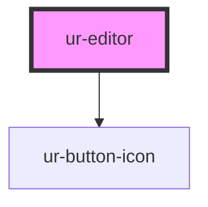

# ur-editor

<!-- Auto Generated Below -->

## Properties

| Property           | Attribute            | Description                                     | Type      | Default                |
| ------------------ | -------------------- | ----------------------------------------------- | --------- | ---------------------- |
| `charLabel`        | `char-label`         | Label for character counter                     | `string`  | `'Characters'`         |
| `content`          | `content`            | The content to edit                             | `string`  | `''`                   |
| `disabled`         | `disabled`           | Whether the editor is disabled                  | `boolean` | `false`                |
| `enableBlockquote` | `enable-blockquote`  | Enable blockquote                               | `boolean` | `true`                 |
| `enableBold`       | `enable-bold`        | Enable bold formatting                          | `boolean` | `true`                 |
| `enableItalic`     | `enable-italic`      | Enable italic formatting                        | `boolean` | `true`                 |
| `enableTextAlign`  | `enable-text-align`  | Enable text alignment                           | `boolean` | `true`                 |
| `enableUnderline`  | `enable-underline`   | Enable underline formatting                     | `boolean` | `true`                 |
| `maxLength`        | `max-length`         | Optional max length for content (in characters) | `number`  | `0`                    |
| `maxWords`         | `max-words`          | Optional max word count                         | `number`  | `0`                    |
| `placeholder`      | `placeholder`        | Placeholder text when content is empty          | `string`  | `'Tell your story...'` |
| `showCounter`      | `show-counter`       | Show character and word counter                 | `boolean` | `false`                |
| `showFixedToolbar` | `show-fixed-toolbar` | Show fixed toolbar or only selection tooltip    | `boolean` | `true`                 |
| `wordLabel`        | `word-label`         | Label for word counter                          | `string`  | `'Words'`              |

## Events

| Event            | Description                        | Type                  |
| ---------------- | ---------------------------------- | --------------------- |
| `contentChanged` | Event emitted when content changes | `CustomEvent<string>` |

## Methods

### `clearContent() => Promise<void>`

Public method to clear content

#### Returns

Type: `Promise<void>`

### `getHTML() => Promise<string>`

Public method to get HTML content

#### Returns

Type: `Promise<string>`

### `getText() => Promise<string>`

Public method to get text content

#### Returns

Type: `Promise<string>`

### `setContent(content: string) => Promise<void>`

Public method to set content

#### Parameters

| Name      | Type     | Description |
| --------- | -------- | ----------- |
| `content` | `string` |             |

#### Returns

Type: `Promise<void>`

## Dependencies

### Depends on

- [ur-button-icon](../ur-button-icon)

### Graph

----------------------------------------------

*Built with [StencilJS](https://stenciljs.com/)*
