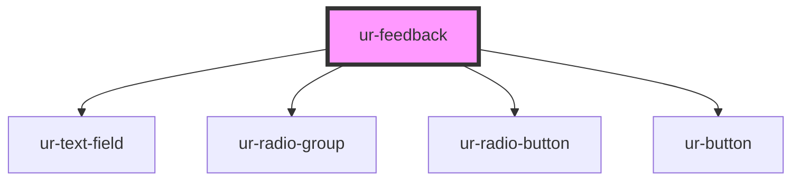

# ur-feedback

<!-- Auto Generated Below -->

## Properties

| Property           | Attribute           | Description                        | Type      | Default                                                                                   |
| ------------------ | ------------------- | ---------------------------------- | --------- | ----------------------------------------------------------------------------------------- |
| `descriptionText`  | `description-text`  | Description text for the modal     | `string`  | `'Please contact us and help us become better for you or just drop us a line saying hi.'` |
| `emailLabel`       | `email-label`       |                                    | `string`  | `'Email'`                                                                                 |
| `emailPlaceholder` | `email-placeholder` |                                    | `string`  | `'Enter your email address'`                                                              |
| `failureText`      | `failure-text`      | Text for failure message           | `string`  | `'An error occurred.'`                                                                    |
| `feedbackText`     | `feedback-text`     | Text for the feedback radio option | `string`  | `'Feedback'`                                                                              |
| `messageLabel`     | `message-label`     |                                    | `string`  | `'Type your message here'`                                                                |
| `placeholderText`  | `placeholder-text`  | Placeholder text for the textarea  | `string`  | `'Write your message here'`                                                               |
| `pressText`        | `press-text`        | Text for the press radio option    | `string`  | `'Press'`                                                                                 |
| `sendText`         | `send-text`         | Text for the send button           | `string`  | `'Send'`                                                                                  |
| `successText`      | `success-text`      | Text for success message           | `string`  | `'Thank you!'`                                                                            |
| `supportText`      | `support-text`      | Text for the support radio option  | `string`  | `'Support'`                                                                               |
| `titleText`        | `title-text`        | Title text for the modal           | `string`  | `'Oh, you mighty storyteller...'`                                                         |
| `user`             | `user`              | Whether the user is logged in      | `boolean` | `false`                                                                                   |

## Events

| Event            | Description                              | Type                                                                 |
| ---------------- | ---------------------------------------- | -------------------------------------------------------------------- |
| `feedbackSubmit` | Event emitted when feedback is submitted | `CustomEvent<{ type: FeedbackType; text: string; email?: string; }>` |

## Methods

### `handleSubmitFailure() => Promise<void>`

Handle failed submission

#### Returns

Type: `Promise<void>`

### `handleSubmitSuccess() => Promise<void>`

Handle successful submission

#### Returns

Type: `Promise<void>`

### `reset() => Promise<void>`

Reset the form

#### Returns

Type: `Promise<void>`

## Dependencies

### Depends on

- [ur-text-field](../ur-text-field)
- [ur-radio-group](../ur-radio-group)
- [ur-radio-button](../ur-radio-button)
- [ur-button](../ur-button)

### Graph

----------------------------------------------

*Built with [StencilJS](https://stenciljs.com/)*
