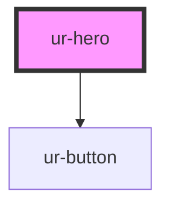

# ur-hero

<!-- Auto Generated Below -->

## Properties

| Property                  | Attribute                  | Description | Type                            | Default                |
| ------------------------- | -------------------------- | ----------- | ------------------------------- | ---------------------- |
| `backgroundAlignment`     | `background-alignment`     |             | `"center" \| "left" \| "right"` | `'center'`             |
| `backgroundColor`         | `background-color`         |             | `string`                        | `'rgba(0, 0, 0, 0.5)'` |
| `backgroundImage`         | `background-image`         |             | `string`                        | `undefined`            |
| `backgroundJustification` | `background-justification` |             | `"bottom" \| "center" \| "top"` | `'center'`             |
| `ctaText`                 | `cta-text`                 |             | `string`                        | `undefined`            |
| `heroSubtitle`            | `hero-subtitle`            |             | `string`                        | `undefined`            |
| `heroSubtitleColor`       | `hero-subtitle-color`      |             | `string`                        | `'#ccc'`               |
| `heroTitle`               | `hero-title`               |             | `string`                        | `undefined`            |
| `heroTitleColor`          | `hero-title-color`         |             | `string`                        | `'#fff'`               |
| `layout`                  | `layout`                   |             | `"center" \| "left" \| "right"` | `'center'`             |

## Events

| Event        | Description | Type                |
| ------------ | ----------- | ------------------- |
| `ctaClicked` |             | `CustomEvent<void>` |

## Dependencies

### Depends on

- [ur-button](../ur-button)

### Graph

----------------------------------------------

*Built with [StencilJS](https://stenciljs.com/)*
