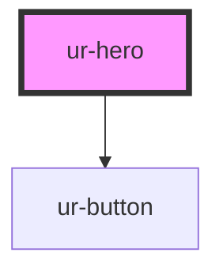

# ur-hero

<!-- Auto Generated Below -->

## Properties

| Property                  | Attribute                  | Description                                               | Type                            | Default                |
| ------------------------- | -------------------------- | --------------------------------------------------------- | ------------------------------- | ---------------------- |
| `backgroundAlignment`     | `background-alignment`     | Background horizontal alignment: left, center, or right   | `"center" \| "left" \| "right"` | `'center'`             |
| `backgroundColor`         | `background-color`         | Background color overlay                                  | `string`                        | `'rgba(0, 0, 0, 0.5)'` |
| `backgroundImage`         | `background-image`         | Background image URL                                      | `string`                        | `undefined`            |
| `backgroundJustification` | `background-justification` | Background vertical justification: top, center, or bottom | `"bottom" \| "center" \| "top"` | `'center'`             |
| `ctaText`                 | `cta-text`                 | Call to action button text                                | `string`                        | `undefined`            |
| `heroSubtitle`            | `hero-subtitle`            | Hero subtitle                                             | `string`                        | `undefined`            |
| `heroSubtitleColor`       | `hero-subtitle-color`      | Hero subtitle color                                       | `string`                        | `'#cccccc'`            |
| `heroTitle`               | `hero-title`               | Hero title                                                | `string`                        | `undefined`            |
| `heroTitleColor`          | `hero-title-color`         | Hero title color                                          | `string`                        | `'#ffffff'`            |
| `layout`                  | `layout`                   | Layout variant: left, right, or center                    | `"center" \| "left" \| "right"` | `'center'`             |

## Events

| Event        | Description                              | Type                |
| ------------ | ---------------------------------------- | ------------------- |
| `ctaClicked` | Event emitted when CTA button is clicked | `CustomEvent<void>` |

## Dependencies

### Depends on

- [ur-button](../ur-button)

### Graph

----------------------------------------------

*Built with [StencilJS](https://stenciljs.com/)*
