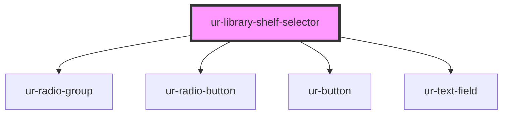

# ur-library-shelf-selector

<!-- Auto Generated Below -->

## Properties

| Property                     | Attribute                        | Description | Type                  | Default                                                                 |
| ---------------------------- | -------------------------------- | ----------- | --------------------- | ----------------------------------------------------------------------- |
| `chooseButtonText`           | `choose-button-text`             |             | `string`              | `'Choose'`                                                              |
| `chooseShelfLabelText`       | `choose-shelf-label-text`        |             | `string`              | `'You can add this story to a shelf in your library.'`                  |
| `createButtonText`           | `create-button-text`             |             | `string`              | `'Create'`                                                              |
| `createNewShelfLabelText`    | `create-new-shelf-label-text`    |             | `string`              | `'Create a new shelf'`                                                  |
| `createNewShelfSubtitleText` | `create-new-shelf-subtitle-text` |             | `string`              | `'Create a shelve and organize your favorite stories in your Library.'` |
| `newShelfPlaceholder`        | `new-shelf-placeholder`          |             | `string`              | `'Please enter a shelf name'`                                           |
| `orCreateNewShelf`           | `or-create-new-shelf`            |             | `string`              | `'or create a new one'`                                                 |
| `selectedShelf`              | `selected-shelf`                 |             | `string`              | `''`                                                                    |
| `shelves`                    | `shelves`                        |             | `{ name: string; }[]` | `[]`                                                                    |

## Events

| Event              | Description | Type                                  |
| ------------------ | ----------- | ------------------------------------- |
| `chooseShelfEvent` |             | `CustomEvent<{ shelfName: string; }>` |
| `createShelfEvent` |             | `CustomEvent<{ shelfName: string; }>` |

## Dependencies

### Depends on

- [ur-radio-group](../ur-radio-group)
- [ur-radio-button](../ur-radio-button)
- [ur-button](../ur-button)
- [ur-text-field](../ur-text-field)

### Graph

----------------------------------------------

*Built with [StencilJS](https://stenciljs.com/)*
