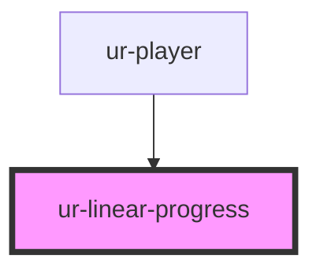

# ur-linear-progress

<!-- Auto Generated Below -->

## Properties

| Property | Attribute | Description                                                                                       | Type     | Default |
| -------- | --------- | ------------------------------------------------------------------------------------------------- | -------- | ------- |
| `max`    | `max`     | The maximum value of the progress indicator.                                                      | `number` | `1`     |
| `value`  | `value`   | The current value of the progress indicator. If null or undefined, the progress is indeterminate. | `number` | `null`  |

## Shadow Parts

| Part          | Description |
| ------------- | ----------- |
| `"indicator"` |             |

## Dependencies

### Used by

 - [ur-player](../ur-player)

### Graph

----------------------------------------------

*Built with [StencilJS](https://stenciljs.com/)*
