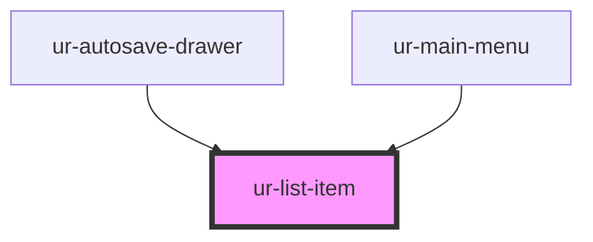

# ur-list-item

<!-- Auto Generated Below -->

## Properties

| Property       | Attribute      | Description | Type                                         | Default     |
| -------------- | -------------- | ----------- | -------------------------------------------- | ----------- |
| `active`       | `active`       |             | `boolean`                                    | `false`     |
| `alignment`    | `alignment`    |             | `"center" \| "end" \| "start"`               | `'center'`  |
| `content`      | `content`      |             | `string`                                     | `undefined` |
| `description`  | `description`  |             | `string`                                     | `undefined` |
| `disabled`     | `disabled`     |             | `boolean`                                    | `false`     |
| `endIcon`      | `end-icon`     |             | `string`                                     | `undefined` |
| `href`         | `href`         |             | `string`                                     | `undefined` |
| `icon`         | `icon`         |             | `string`                                     | `undefined` |
| `nonclickable` | `nonclickable` |             | `boolean`                                    | `false`     |
| `rel`          | `rel`          |             | `string`                                     | `undefined` |
| `rounded`      | `rounded`      |             | `boolean`                                    | `false`     |
| `target`       | `target`       |             | `"_blank" \| "_parent" \| "_self" \| "_top"` | `undefined` |

## Dependencies

### Used by

 - [ur-autosave-drawer](../ur-autosave-drawer)
 - [ur-main-menu](../ur-main-menu)

### Graph

----------------------------------------------

*Built with [StencilJS](https://stenciljs.com/)*
