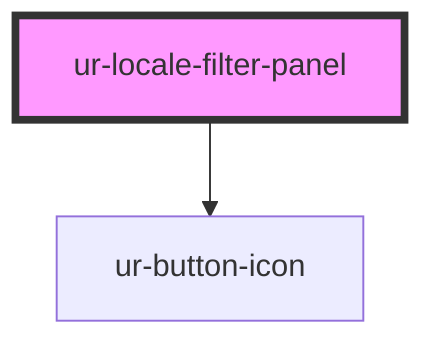

# ur-locale-filter-panel

<!-- Auto Generated Below -->

## Properties

| Property     | Attribute     | Description | Type                                                 | Default |
| ------------ | ------------- | ----------- | ---------------------------------------------------- | ------- |
| `locales`    | --            |             | `[label: string, value: string, checked: boolean][]` | `[]`    |
| `showFooter` | `show-footer` |             | `boolean`                                            | `true`  |
| `showHeader` | `show-header` |             | `boolean`                                            | `true`  |

## Events

| Event    | Description | Type                |
| -------- | ----------- | ------------------- |
| `cancel` |             | `CustomEvent<void>` |
| `save`   |             | `CustomEvent<void>` |

## Dependencies

### Depends on

- [ur-button-icon](../ur-button-icon)

### Graph

----------------------------------------------

*Built with [StencilJS](https://stenciljs.com/)*
