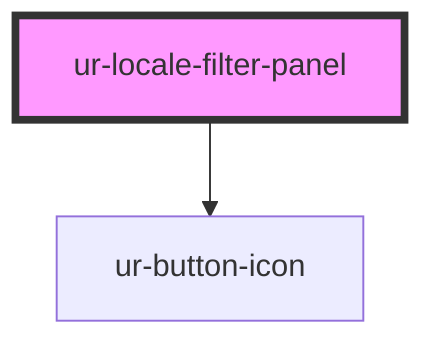

# ur-locale-filter-panel

<!-- Auto Generated Below -->

## Properties

| Property     | Attribute     | Description                 | Type                                                    | Default |
| ------------ | ------------- | --------------------------- | ------------------------------------------------------- | ------- |
| `locales`    | --            | List of available languages | `{ label: string; value: string; checked: boolean; }[]` | `[]`    |
| `showFooter` | `show-footer` | Whether to show the footer  | `boolean`                                               | `true`  |
| `showHeader` | `show-header` | Whether to show the header  | `boolean`                                               | `true`  |

## Events

| Event    | Description                         | Type                    |
| -------- | ----------------------------------- | ----------------------- |
| `cancel` | Event emitted when canceling        | `CustomEvent<void>`     |
| `save`   | Event emitted when saving languages | `CustomEvent<string[]>` |

## Dependencies

### Depends on

- [ur-button-icon](../ur-button-icon)

### Graph

----------------------------------------------

*Built with [StencilJS](https://stenciljs.com/)*
