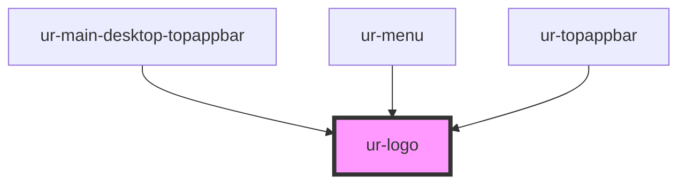

# ur-logo

<!-- Auto Generated Below -->

## Properties

| Property   | Attribute  | Description                           | Type     | Default          |
| ---------- | ---------- | ------------------------------------- | -------- | ---------------- |
| `color`    | `color`    | Color of the logo                     | `string` | `'currentColor'` |
| `height`   | `height`   | Height of the logo                    | `string` | `'19'`           |
| `opacity`  | `opacity`  | Opacity of the logo                   | `number` | `0.9`            |
| `rotation` | `rotation` | Rotation angle of the logo in degrees | `number` | `0`              |
| `width`    | `width`    | Width of the logo                     | `string` | `'70'`           |

## Dependencies

### Used by

 - [ur-main-desktop-topappbar](../topappbars/main-desktop-topappbar)
 - [ur-menu](../ur-menu)
 - [ur-topappbar](../topappbars/ur-topappbar)

### Graph

----------------------------------------------

*Built with [StencilJS](https://stenciljs.com/)*
