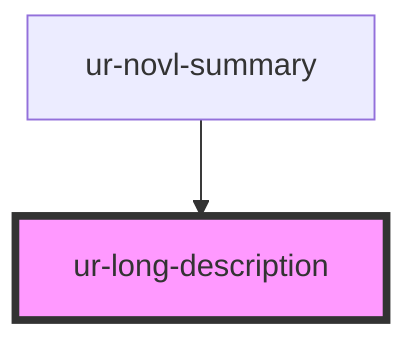

# ur-long-description

<!-- Auto Generated Below -->

## Properties

| Property       | Attribute        | Description | Type     | Default          |
| -------------- | ---------------- | ----------- | -------- | ---------------- |
| `description`  | `description`    |             | `string` | `undefined`      |
| `showLessText` | `show-less-text` |             | `string` | `'Show less'`    |
| `showMoreText` | `show-more-text` |             | `string` | `'Show more...'` |

## Dependencies

### Used by

 - [ur-novl-summary](../ur-novl-summary)

### Graph

----------------------------------------------

*Built with [StencilJS](https://stenciljs.com/)*
