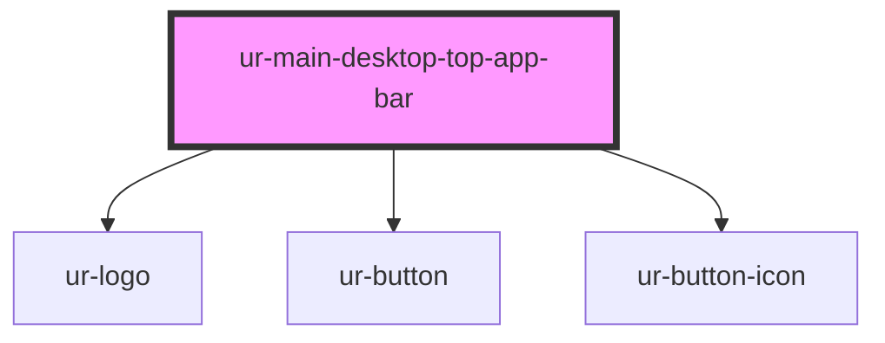

# ur-main-desktop-topappbar

<!-- Auto Generated Below -->

## Properties

| Property        | Attribute        | Description | Type                    | Default                                      |
| --------------- | ---------------- | ----------- | ----------------------- | -------------------------------------------- |
| `deviceVariant` | `device-variant` |             | `"desktop" \| "mobile"` | `'desktop'`                                  |
| `fontColor`     | `font-color`     |             | `string`                | `undefined`                                  |
| `logoOpacity`   | `logo-opacity`   |             | `number`                | `1`                                          |
| `logoRotation`  | `logo-rotation`  |             | `number`                | `0`                                          |
| `quillCount`    | `quill-count`    |             | `number`                | `undefined`                                  |
| `quillText`     | `quill-text`     |             | `string`                | `'Quills'`                                   |
| `searchText`    | `search-text`    |             | `string`                | `'Search for stories, writers & publishers'` |
| `variant`       | `variant`        |             | `string`                | `'small'`                                    |

## Events

| Event               | Description | Type                |
| ------------------- | ----------- | ------------------- |
| `quillClicked`      |             | `CustomEvent<void>` |
| `searchLinkClicked` |             | `CustomEvent<void>` |
| `themeToggle`       |             | `CustomEvent<void>` |

## Dependencies

### Depends on

- [ur-logo](../ur-logo)
- [ur-button](../ur-button)
- [ur-button-icon](../ur-button-icon)

### Graph

----------------------------------------------

*Built with [StencilJS](https://stenciljs.com/)*
