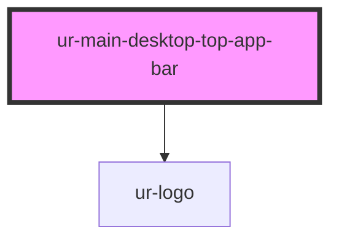

# ur-main-desktop-topappbar

<!-- Auto Generated Below -->

## Properties

| Property       | Attribute       | Description | Type     | Default                                      |
| -------------- | --------------- | ----------- | -------- | -------------------------------------------- |
| `logoOpacity`  | `logo-opacity`  |             | `number` | `1`                                          |
| `logoRotation` | `logo-rotation` |             | `number` | `0`                                          |
| `searchText`   | `search-text`   |             | `string` | `'Search for stories, writers & publishers'` |
| `variant`      | `variant`       |             | `string` | `'small'`                                    |

## Events

| Event               | Description | Type                |
| ------------------- | ----------- | ------------------- |
| `searchLinkClicked` |             | `CustomEvent<void>` |

## Dependencies

### Depends on

- [ur-logo](../ur-logo)

### Graph

----------------------------------------------

*Built with [StencilJS](https://stenciljs.com/)*
