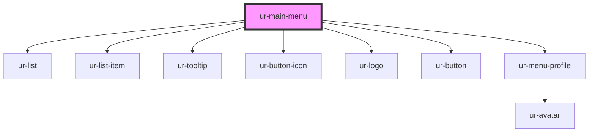

# ur-menu

<!-- Auto Generated Below -->

## Properties

| Property            | Attribute             | Description | Type      | Default                          |
| ------------------- | --------------------- | ----------- | --------- | -------------------------------- |
| `acceptableUseText` | `acceptable-use-text` |             | `string`  | `'Quills Acceptable Use Policy'` |
| `badgeCount`        | `badge-count`         |             | `number`  | `10`                             |
| `competitionsText`  | `competitions-text`   |             | `string`  | `'Competitions'`                 |
| `contactUsText`     | `contact-us-text`     |             | `string`  | `'Contact us'`                   |
| `discordText`       | `discord-text`        |             | `string`  | `'Our Discord'`                  |
| `facebookText`      | `facebook-text`       |             | `string`  | `'Our Facebook'`                 |
| `faqsText`          | `faqs-text`           |             | `string`  | `'FAQs'`                         |
| `homeText`          | `home-text`           |             | `string`  | `'Home'`                         |
| `loggedIn`          | `logged-in`           |             | `boolean` | `undefined`                      |
| `notificationText`  | `notification-text`   |             | `string`  | `'Notifications'`                |
| `opened`            | `opened`              |             | `boolean` | `false`                          |
| `pagesText`         | `pages-text`          |             | `string`  | `'Pages'`                        |
| `partnershipText`   | `partnership-text`    |             | `string`  | `'Partnership Program'`          |
| `paymentText`       | `payment-text`        |             | `string`  | `'Payment Terms'`                |
| `premiumText`       | `premium-text`        |             | `string`  | `'Go Premium'`                   |
| `privacyText`       | `privacy-text`        |             | `string`  | `'Privacy Policy'`               |
| `rulesText`         | `rules-text`          |             | `string`  | `'House Rules'`                  |
| `signUpText`        | `sign-up-text`        |             | `string`  | `'Sign Up/In'`                   |
| `storiesText`       | `stories-text`        |             | `string`  | `'Stories'`                      |
| `termsText`         | `terms-text`          |             | `string`  | `'Terms of Service'`             |
| `userAvatar`        | `user-avatar`         |             | `string`  | `undefined`                      |
| `userName`          | `user-name`           |             | `string`  | `undefined`                      |
| `userRole`          | `user-role`           |             | `string`  | `undefined`                      |
| `whatsNewText`      | `whats-new-text`      |             | `string`  | `'What\'s new'`                  |
| `xText`             | `x-text`              |             | `string`  | `'Our X'`                        |

## Events

| Event                     | Description | Type                   |
| ------------------------- | ----------- | ---------------------- |
| `acceptableUseClick`      |             | `CustomEvent<void>`    |
| `competitionsClick`       |             | `CustomEvent<void>`    |
| `contactUsClick`          |             | `CustomEvent<void>`    |
| `discordClick`            |             | `CustomEvent<void>`    |
| `facebookClick`           |             | `CustomEvent<void>`    |
| `faqsClick`               |             | `CustomEvent<void>`    |
| `homeClick`               |             | `CustomEvent<void>`    |
| `menuToggleClick`         |             | `CustomEvent<boolean>` |
| `notificationCenterClick` |             | `CustomEvent<void>`    |
| `pagesClick`              |             | `CustomEvent<void>`    |
| `partnershipClick`        |             | `CustomEvent<void>`    |
| `paymentClick`            |             | `CustomEvent<void>`    |
| `premiumClick`            |             | `CustomEvent<void>`    |
| `privacyClick`            |             | `CustomEvent<void>`    |
| `rulesClick`              |             | `CustomEvent<void>`    |
| `signUpClick`             |             | `CustomEvent<void>`    |
| `storiesClick`            |             | `CustomEvent<void>`    |
| `termsClick`              |             | `CustomEvent<void>`    |
| `toggleExpand`            |             | `CustomEvent<boolean>` |
| `viewProfileClick`        |             | `CustomEvent<void>`    |
| `whatsNewClick`           |             | `CustomEvent<void>`    |
| `xClick`                  |             | `CustomEvent<void>`    |

## Dependencies

### Depends on

- [ur-list](../ur-list)
- [ur-list-item](../ur-list)
- [ur-tooltip](../ur-tooltip)
- [ur-button-icon](../ur-button-icon)
- [ur-logo](../ur-logo)
- [ur-button](../ur-button)
- [ur-menu-profile](../ur-menu-profile)

### Graph

----------------------------------------------

*Built with [StencilJS](https://stenciljs.com/)*
