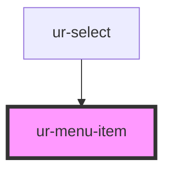

# ur-menu-item

<!-- Auto Generated Below -->

## Properties

| Property   | Attribute  | Description | Type      | Default |
| ---------- | ---------- | ----------- | --------- | ------- |
| `disabled` | `disabled` |             | `boolean` | `false` |
| `label`    | `label`    |             | `string`  | `''`    |
| `value`    | `value`    |             | `string`  | `''`    |

## Events

| Event         | Description | Type                  |
| ------------- | ----------- | --------------------- |
| `itemClicked` |             | `CustomEvent<string>` |

## Dependencies

### Used by

 - [ur-select](../ur-select)

### Graph

----------------------------------------------

*Built with [StencilJS](https://stenciljs.com/)*
