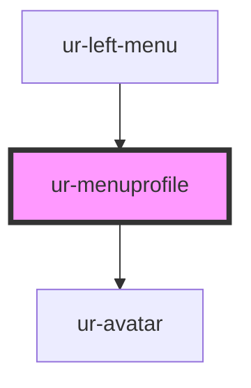

# ur-menuprofile

<!-- Auto Generated Below -->

## Properties

| Property     | Attribute     | Description | Type     | Default     |
| ------------ | ------------- | ----------- | -------- | ----------- |
| `userAvatar` | `user-avatar` |             | `string` | `undefined` |
| `userName`   | `user-name`   |             | `string` | `undefined` |
| `userRole`   | `user-role`   |             | `string` | `undefined` |

## Dependencies

### Used by

 - [ur-left-menu](../ur-menu)

### Depends on

- [ur-avatar](../ur-avatar)

### Graph

----------------------------------------------

*Built with [StencilJS](https://stenciljs.com/)*
