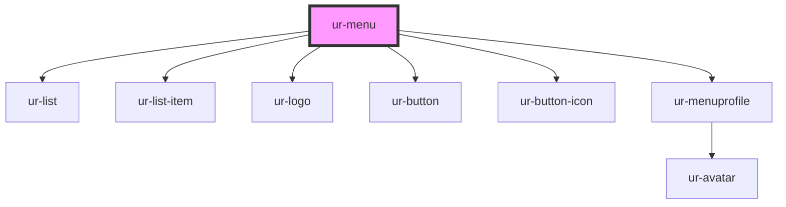

# ur-menu

<!-- Auto Generated Below -->

## Properties

| Property     | Attribute      | Description | Type      | Default     |
| ------------ | -------------- | ----------- | --------- | ----------- |
| `isLoggedIn` | `is-logged-in` |             | `boolean` | `undefined` |
| `userAvatar` | `user-avatar`  |             | `string`  | `undefined` |
| `userName`   | `user-name`    |             | `string`  | `undefined` |
| `userRole`   | `user-role`    |             | `string`  | `undefined` |

## Events

| Event          | Description | Type                   |
| -------------- | ----------- | ---------------------- |
| `toggleExpand` |             | `CustomEvent<boolean>` |

## Dependencies

### Depends on

- [ur-list](../ur-list)
- [ur-list-item](../ur-list)
- [ur-logo](../ur-logo)
- [ur-button](../ur-button)
- [ur-button-icon](../ur-button-icon)
- [ur-menuprofile](../ur-menuprofile)

### Graph

----------------------------------------------

*Built with [StencilJS](https://stenciljs.com/)*
