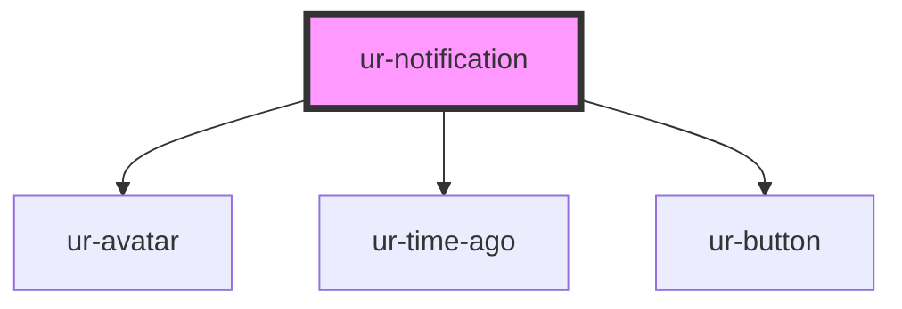

# ur-notification

<!-- Auto Generated Below -->

## Properties

| Property                    | Attribute | Description | Type                                                                                                                                                                   | Default     |
| --------------------------- | --------- | ----------- | ---------------------------------------------------------------------------------------------------------------------------------------------------------------------- | ----------- |
| `notification` _(required)_ | --        |             | `CommentNotification \| FollowNotification \| MembershipAcceptNotification \| MembershipRejectNotification \| MembershipRequestNotification \| PageFollowNotification` | `undefined` |

## Events

| Event               | Description | Type                             |
| ------------------- | ----------- | -------------------------------- |
| `notificationEvent` |             | `CustomEvent<NotificationEvent>` |

## Dependencies

### Depends on

- [ur-avatar](../ur-avatar)
- [ur-time-ago](../ur-time-ago)
- [ur-button](../ur-button)

### Graph

----------------------------------------------

*Built with [StencilJS](https://stenciljs.com/)*
