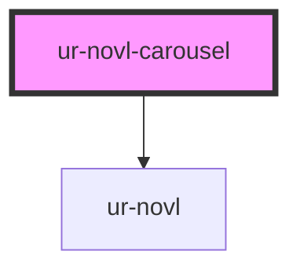

# ur-novl-carousel

<!-- Auto Generated Below -->

## Properties

| Property        | Attribute         | Description | Type                                                                  | Default                                        |
| --------------- | ----------------- | ----------- | --------------------------------------------------------------------- | ---------------------------------------------- |
| `breakpoints`   | --                |             | `{ [width: number]: SwiperOptions; [ratio: string]: SwiperOptions; }` | `{         // add default     }`               |
| `grid`          | --                |             | `GridOptions`                                                         | `{         rows: 1,         fill: 'row'     }` |
| `novls`         | --                |             | `Novl[]`                                                              | `[]`                                           |
| `slidesPerView` | `slides-per-view` |             | `"auto" \| number`                                                    | `'auto'`                                       |
| `spaceBetween`  | `space-between`   |             | `number \| string`                                                    | `'0'`                                          |

## Dependencies

### Depends on

- [ur-novl](../ur-novl)

### Graph

----------------------------------------------

*Built with [StencilJS](https://stenciljs.com/)*
