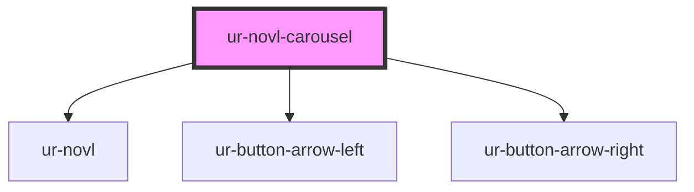

# ur-novl-carousel

<!-- Auto Generated Below -->

## Properties

| Property           | Attribute           | Description | Type                                              | Default                                        |
| ------------------ | ------------------- | ----------- | ------------------------------------------------- | ---------------------------------------------- |
| `breakpoints`      | --                  |             | `{ [width: number]: any; [ratio: string]: any; }` | `{         // add default     }`               |
| `destroyListeners` | `destroy-listeners` |             | `boolean`                                         | `true`                                         |
| `grid`             | --                  |             | `{ rows?: number; fill?: "row" \| "column"; }`    | `{         rows: 1,         fill: 'row'     }` |
| `loading`          | `loading`           |             | `boolean`                                         | `false`                                        |
| `navigation`       | `navigation`        |             | `boolean`                                         | `false`                                        |
| `novls`            | --                  |             | `(CustomContent \| Novl)[]`                       | `[]`                                           |
| `slidesPerView`    | `slides-per-view`   |             | `"auto" \| number`                                | `'auto'`                                       |
| `spaceBetween`     | `space-between`     |             | `number \| string`                                | `'0'`                                          |

## Events

| Event             | Description | Type                            |
| ----------------- | ----------- | ------------------------------- |
| `nextClicked`     |             | `CustomEvent<void>`             |
| `prevClicked`     |             | `CustomEvent<void>`             |
| `progressUpdated` |             | `CustomEvent<[number, number]>` |

## Methods

### `addNovls(novls: Array<Novl | CustomContent>) => Promise<void>`

#### Parameters

| Name    | Type                        | Description |
| ------- | --------------------------- | ----------- |
| `novls` | `(CustomContent \| Novl)[]` |             |

#### Returns

Type: `Promise<void>`

### `updateNovlsByIndex(updates: Map<number, Novl | CustomContent>) => Promise<void>`

#### Parameters

| Name      | Type                                 | Description |
| --------- | ------------------------------------ | ----------- |
| `updates` | `Map<number, CustomContent \| Novl>` |             |

#### Returns

Type: `Promise<void>`

## Dependencies

### Depends on

- [ur-novl](../ur-novl)
- [ur-button-arrow-left](../ur-button-arrow-left)
- [ur-button-arrow-right](../ur-button-arrow-right)

### Graph

----------------------------------------------

*Built with [StencilJS](https://stenciljs.com/)*
