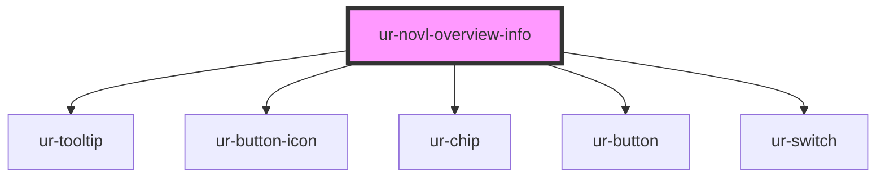

# ur-novl-overview-info

<!-- Auto Generated Below -->

## Properties

| Property                | Attribute                  | Description | Type                    | Default                      |
| ----------------------- | -------------------------- | ----------- | ----------------------- | ---------------------------- |
| `addToLibraryText`      | `add-to-library-text`      |             | `string`                | `'Add to Library'`           |
| `buyStoryText`          | `buy-story-text`           |             | `string`                | `'Buy for'`                  |
| `chapterListText`       | `chapter-list-text`        |             | `string`                | `'Chapters'`                 |
| `completeStoryText`     | `complete-story-text`      |             | `string`                | `'Complete story'`           |
| `completeText`          | `complete-text`            |             | `string`                | `'Complete'`                 |
| `coverImage`            | `cover-image`              |             | `string`                | `undefined`                  |
| `description`           | `description`              |             | `string`                | `'Description'`              |
| `descriptionText`       | `description-text`         |             | `string`                | `'Description'`              |
| `deviceSize`            | `device-size`              |             | `"large" \| "small"`    | `'large'`                    |
| `editDescriptionMode`   | `edit-description-mode`    |             | `boolean`               | `false`                      |
| `editTitleMode`         | `edit-title-mode`          |             | `boolean`               | `false`                      |
| `expanded`              | `expanded`                 |             | `boolean`               | `false`                      |
| `genres`                | `genres`                   |             | `string`                | `'Action, Adventure'`        |
| `hasBranches`           | `has-branches`             |             | `boolean`               | `undefined`                  |
| `isNovlLibrary`         | `is-novl-library`          |             | `boolean`               | `undefined`                  |
| `isOwner`               | `is-owner`                 |             | `boolean`               | `false`                      |
| `isUserLoggedIn`        | `is-user-logged-in`        |             | `boolean`               | `false`                      |
| `languages`             | `languages`                |             | `string`                | `'English'`                  |
| `likes`                 | `likes`                    |             | `number`                | `undefined`                  |
| `likesText`             | `likes-text`               |             | `string`                | `'Likes'`                    |
| `literatureTypes`       | `literature-types`         |             | `string`                | `'Novel'`                    |
| `novlPaid`              | `novl-paid`                |             | `boolean`               | `undefined`                  |
| `novlPrice`             | `novl-price`               |             | `string`                | `undefined`                  |
| `novlPurchasedAt`       | `novl-purchased-at`        |             | `string`                | `''`                         |
| `novlTitle`             | `novl-title`               |             | `string`                | `'This is long story title'` |
| `ongoingText`           | `ongoing-text`             |             | `string`                | `'Ongoing'`                  |
| `ownerAvatar`           | `owner-avatar`             |             | `string`                | `undefined`                  |
| `ownerName`             | `owner-name`               |             | `string`                | `undefined`                  |
| `readStoryText`         | `read-story-text`          |             | `string`                | `'Read story'`               |
| `readingDuration`       | `reading-duration`         |             | `string`                | `'1min'`                     |
| `readingDurationText`   | `reading-duration-text`    |             | `string`                | `'Reading Duration'`         |
| `removeFromLibraryText` | `remove-from-library-text` |             | `string`                | `'Remove from Library'`      |
| `revertStoryText`       | `revert-story-text`        |             | `string`                | `'Revert to ongoing'`        |
| `showLessText`          | `show-less-text`           |             | `string`                | `'Show less'`                |
| `showMoreText`          | `show-more-text`           |             | `string`                | `'Show more...'`             |
| `showPublishedButton`   | `show-published-button`    |             | `boolean`               | `true`                       |
| `storyCompleteStatus`   | `story-complete-status`    |             | `boolean`               | `undefined`                  |
| `views`                 | `views`                    |             | `number`                | `undefined`                  |
| `viewsText`             | `views-text`               |             | `string`                | `'Views'`                    |
| `visibility`            | `visibility`               |             | `"private" \| "public"` | `'public'`                   |
| `visibilityPrivateText` | `visibility-private-text`  |             | `string`                | `'Private story'`            |
| `visibilityPublicText`  | `visibility-public-text`   |             | `string`                | `'Public story'`             |
| `writeEnabled`          | `write-enabled`            |             | `boolean`               | `undefined`                  |
| `writeStoryText`        | `write-story-text`         |             | `string`                | `'Start writing'`            |

## Events

| Event                   | Description | Type               |
| ----------------------- | ----------- | ------------------ |
| `buyStoryEvent`         |             | `CustomEvent<any>` |
| `completeStoryEvent`    |             | `CustomEvent<any>` |
| `editDescriptionEvent`  |             | `CustomEvent<any>` |
| `editTitleEvent`        |             | `CustomEvent<any>` |
| `readStoryEvent`        |             | `CustomEvent<any>` |
| `revertStoryEvent`      |             | `CustomEvent<any>` |
| `toggleLibraryEvent`    |             | `CustomEvent<any>` |
| `visibilityChangeEvent` |             | `CustomEvent<any>` |
| `writeStoryEvent`       |             | `CustomEvent<any>` |

## Methods

### `reset() => Promise<void>`

#### Returns

Type: `Promise<void>`

## Dependencies

### Depends on

- [ur-tooltip](../ur-tooltip)
- [ur-button-icon](../ur-button-icon)
- [ur-chip](../ur-chip)
- [ur-button](../ur-button)
- [ur-switch](../ur-switch)

### Graph

----------------------------------------------

*Built with [StencilJS](https://stenciljs.com/)*
