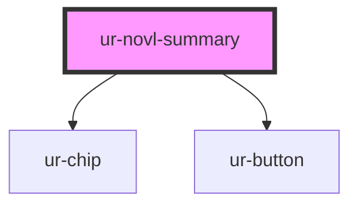

# ur-novl-summary

<!-- Auto Generated Below -->

## Properties

| Property              | Attribute               | Description | Type      | Default                      |
| --------------------- | ----------------------- | ----------- | --------- | ---------------------------- |
| `buyStoryText`        | `buy-story-text`        |             | `string`  | `'Buy for'`                  |
| `completeText`        | `complete-text`         |             | `string`  | `'Complete'`                 |
| `coverImage`          | `cover-image`           |             | `string`  | `undefined`                  |
| `description`         | `description`           |             | `string`  | `'Description'`              |
| `expanded`            | `expanded`              |             | `boolean` | `false`                      |
| `genres`              | `genres`                |             | `string`  | `'Action, Adventure'`        |
| `hasBranches`         | `has-branches`          |             | `boolean` | `undefined`                  |
| `languages`           | `languages`             |             | `string`  | `'English'`                  |
| `learnMoreText`       | `learn-more-text`       |             | `string`  | `'Learn more'`               |
| `likes`               | `likes`                 |             | `number`  | `undefined`                  |
| `likesText`           | `likes-text`            |             | `string`  | `'Likes'`                    |
| `literatureTypes`     | `literature-types`      |             | `string`  | `'Novel'`                    |
| `longDescription`     | `long-description`      |             | `string`  | `undefined`                  |
| `novlPaid`            | `novl-paid`             |             | `boolean` | `undefined`                  |
| `novlPrice`           | `novl-price`            |             | `string`  | `undefined`                  |
| `novlPurchasedAt`     | `novl-purchased-at`     |             | `string`  | `''`                         |
| `novlTitle`           | `novl-title`            |             | `string`  | `'This is long story title'` |
| `ongoingText`         | `ongoing-text`          |             | `string`  | `'Ongoing'`                  |
| `ownerAvatar`         | `owner-avatar`          |             | `string`  | `undefined`                  |
| `ownerName`           | `owner-name`            |             | `string`  | `undefined`                  |
| `readStoryText`       | `read-story-text`       |             | `string`  | `'Read story'`               |
| `readingDuration`     | `reading-duration`      |             | `string`  | `'1min'`                     |
| `readingDurationText` | `reading-duration-text` |             | `string`  | `'Reading Duration'`         |
| `showLessText`        | `show-less-text`        |             | `string`  | `'Show less'`                |
| `showMoreText`        | `show-more-text`        |             | `string`  | `'Show more...'`             |
| `storyCompleteStatus` | `story-complete-status` |             | `boolean` | `undefined`                  |
| `views`               | `views`                 |             | `number`  | `undefined`                  |
| `viewsText`           | `views-text`            |             | `string`  | `'Views'`                    |
| `writeEnabled`        | `write-enabled`         |             | `boolean` | `undefined`                  |
| `writeStoryText`      | `write-story-text`      |             | `string`  | `'Start writing'`            |

## Events

| Event             | Description | Type               |
| ----------------- | ----------- | ------------------ |
| `buyStoryEvent`   |             | `CustomEvent<any>` |
| `learnMoreEvent`  |             | `CustomEvent<any>` |
| `readStoryEvent`  |             | `CustomEvent<any>` |
| `writeStoryEvent` |             | `CustomEvent<any>` |

## Methods

### `reset() => Promise<void>`

#### Returns

Type: `Promise<void>`

## Dependencies

### Depends on

- [ur-chip](../ur-chip)
- [ur-button](../ur-button)

### Graph

----------------------------------------------

*Built with [StencilJS](https://stenciljs.com/)*
