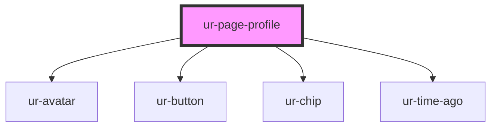

# ur-page-profile

<!-- Auto Generated Below -->

## Properties

| Property              | Attribute               | Description | Type                                               | Default              |
| --------------------- | ----------------------- | ----------- | -------------------------------------------------- | -------------------- |
| `about`               | `about`                 |             | `any`                                              | `null`               |
| `avatar`              | `avatar`                |             | `any`                                              | `undefined`          |
| `becomeMemberText`    | `become-member-text`    |             | `string`                                           | `'Become a Member'`  |
| `createdByText`       | `created-by-text`       |             | `string`                                           | `'Created by'`       |
| `donateText`          | `donate-text`           |             | `string`                                           | `'Donate'`           |
| `email`               | `email`                 |             | `any`                                              | `null`               |
| `facebook_url`        | `facebook_url`          |             | `any`                                              | `null`               |
| `followText`          | `follow-text`           |             | `string`                                           | `'Follow'`           |
| `followed`            | `followed`              |             | `boolean`                                          | `false`              |
| `followers`           | `followers`             |             | `number`                                           | `null`               |
| `followersText`       | `followers-text`        |             | `string`                                           | `'Followers'`        |
| `following`           | `following`             |             | `number`                                           | `null`               |
| `genres`              | `genres`                |             | `string`                                           | `null`               |
| `genresText`          | `genres-text`           |             | `string`                                           | `'Genres'`           |
| `inviteMembersText`   | `invite-members-text`   |             | `string`                                           | `'Invite Members'`   |
| `isPageOwner`         | `is-page-owner`         |             | `boolean`                                          | `false`              |
| `languages`           | `languages`             |             | `string`                                           | `null`               |
| `languagesText`       | `languages-text`        |             | `string`                                           | `'Languages'`        |
| `linkedin_url`        | `linkedin_url`          |             | `any`                                              | `null`               |
| `literatureTypes`     | `literature-types`      |             | `string`                                           | `null`               |
| `literatureTypesText` | `literature-types-text` |             | `string`                                           | `'Literature Types'` |
| `location`            | `location`              |             | `any`                                              | `null`               |
| `members`             | `members`               |             | `number`                                           | `null`               |
| `membersText`         | `members-text`          |             | `string`                                           | `'Members'`          |
| `name`                | `name`                  |             | `any`                                              | `undefined`          |
| `pageCreatedText`     | `page-created-text`     |             | `string`                                           | `'Page created'`     |
| `pageCreationDate`    | `page-creation-date`    |             | `any`                                              | `null`               |
| `pageCreatorImage`    | `page-creator-image`    |             | `any`                                              | `null`               |
| `pageCreatorName`     | `page-creator-name`     |             | `any`                                              | `null`               |
| `pageId`              | `page-id`               |             | `string`                                           | `undefined`          |
| `pageType`            | `page-type`             |             | `string`                                           | `null`               |
| `phone`               | `phone`                 |             | `any`                                              | `null`               |
| `platform`            | `platform`              |             | `"desktop" \| "mobile-main" \| "mobile-secondary"` | `'desktop'`          |
| `sendMessageText`     | `send-message-text`     |             | `string`                                           | `'Message'`          |
| `showBecomeMember`    | `show-become-member`    |             | `boolean`                                          | `false`              |
| `showDonate`          | `show-donate`           |             | `boolean`                                          | `false`              |
| `showFollow`          | `show-follow`           |             | `boolean`                                          | `false`              |
| `showSendMessage`     | `show-send-message`     |             | `boolean`                                          | `false`              |
| `stories`             | `stories`               |             | `number`                                           | `null`               |
| `storiesText`         | `stories-text`          |             | `string`                                           | `'Stories'`          |
| `twitter_url`         | `twitter_url`           |             | `any`                                              | `null`               |
| `views`               | `views`                 |             | `number`                                           | `null`               |
| `viewsText`           | `views-text`            |             | `string`                                           | `'Views'`            |
| `website`             | `website`               |             | `any`                                              | `null`               |
| `websiteText`         | `website-text`          |             | `string`                                           | `'Visit website'`    |

## Events

| Event               | Description | Type                                                  |
| ------------------- | ----------- | ----------------------------------------------------- |
| `donate`            |             | `CustomEvent<any>`                                    |
| `emailClick`        |             | `CustomEvent<any>`                                    |
| `facebookClick`     |             | `CustomEvent<any>`                                    |
| `followersClick`    |             | `CustomEvent<any>`                                    |
| `inviteMembers`     |             | `CustomEvent<any>`                                    |
| `linkedinClick`     |             | `CustomEvent<any>`                                    |
| `member`            |             | `CustomEvent<any>`                                    |
| `membersClick`      |             | `CustomEvent<any>`                                    |
| `pageCreatorClick`  |             | `CustomEvent<any>`                                    |
| `pageFollowClicked` |             | `CustomEvent<{ pageId: string; followed: boolean; }>` |
| `phoneClick`        |             | `CustomEvent<any>`                                    |
| `sendMessage`       |             | `CustomEvent<any>`                                    |
| `twitterClick`      |             | `CustomEvent<any>`                                    |
| `websiteClick`      |             | `CustomEvent<any>`                                    |

## Dependencies

### Depends on

- [ur-avatar](../ur-avatar)
- [ur-button](../ur-button)
- [ur-chip](../ur-chip)
- [ur-time-ago](../ur-time-ago)

### Graph

----------------------------------------------

*Built with [StencilJS](https://stenciljs.com/)*
