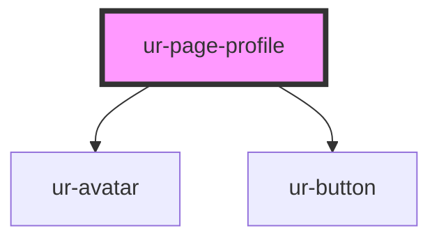

# ur-page-profile

<!-- Auto Generated Below -->

## Properties

| Property           | Attribute            | Description | Type      | Default     |
| ------------------ | -------------------- | ----------- | --------- | ----------- |
| `avatar`           | `avatar`             |             | `any`     | `undefined` |
| `description`      | `description`        |             | `any`     | `null`      |
| `email`            | `email`              |             | `any`     | `null`      |
| `facebook_url`     | `facebook_url`       |             | `any`     | `null`      |
| `followers`        | `followers`          |             | `number`  | `null`      |
| `following`        | `following`          |             | `number`  | `null`      |
| `genres`           | `genres`             |             | `string`  | `null`      |
| `languages`        | `languages`          |             | `string`  | `null`      |
| `linkedin_url`     | `linkedin_url`       |             | `any`     | `null`      |
| `literatureTypes`  | `literature-types`   |             | `string`  | `null`      |
| `location`         | `location`           |             | `any`     | `null`      |
| `members`          | `members`            |             | `number`  | `null`      |
| `name`             | `name`               |             | `any`     | `undefined` |
| `pageCreationDate` | `page-creation-date` |             | `any`     | `null`      |
| `pageCreatorImage` | `page-creator-image` |             | `any`     | `null`      |
| `pageCreatorName`  | `page-creator-name`  |             | `any`     | `null`      |
| `phone`            | `phone`              |             | `any`     | `null`      |
| `showBecomeMember` | `show-become-member` |             | `boolean` | `false`     |
| `showDonate`       | `show-donate`        |             | `boolean` | `false`     |
| `showFollow`       | `show-follow`        |             | `boolean` | `false`     |
| `showSendMessage`  | `show-send-message`  |             | `boolean` | `false`     |
| `stories`          | `stories`            |             | `number`  | `null`      |
| `twitter_url`      | `twitter_url`        |             | `any`     | `null`      |
| `views`            | `views`              |             | `number`  | `null`      |
| `website`          | `website`            |             | `any`     | `null`      |

## Events

| Event         | Description | Type               |
| ------------- | ----------- | ------------------ |
| `donate`      |             | `CustomEvent<any>` |
| `follow`      |             | `CustomEvent<any>` |
| `member`      |             | `CustomEvent<any>` |
| `sendMessage` |             | `CustomEvent<any>` |

## Dependencies

### Depends on

- [ur-avatar](../ur-avatar)
- [ur-button](../ur-button)

### Graph

----------------------------------------------

*Built with [StencilJS](https://stenciljs.com/)*
