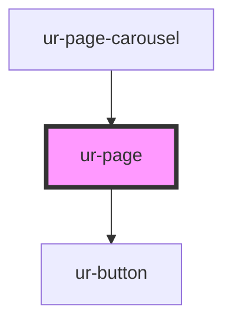

# ur-page

<!-- Auto Generated Below -->

## Properties

| Property            | Attribute             | Description | Type      | Default               |
| ------------------- | --------------------- | ----------- | --------- | --------------------- |
| `borderRadius`      | `border-radius`       |             | `string`  | `'8px'`               |
| `followed`          | `followed`            |             | `boolean` | `false`               |
| `followers`         | `followers`           |             | `number`  | `0`                   |
| `loading`           | `loading`             |             | `boolean` | `false`               |
| `pageCover`         | `page-cover`          |             | `string`  | `undefined`           |
| `pageCoverFallback` | `page-cover-fallback` |             | `string`  | `PAGE_COVER_FALLBACK` |
| `pageDescription`   | `page-description`    |             | `string`  | `undefined`           |
| `pageId`            | `page-id`             |             | `string`  | `undefined`           |
| `pageTitle`         | `page-title`          |             | `string`  | `'Page title'`        |
| `pageType`          | `page-type`           |             | `string`  | `undefined`           |
| `showStats`         | `show-stats`          |             | `boolean` | `true`                |

## Events

| Event               | Description | Type                             |
| ------------------- | ----------- | -------------------------------- |
| `pageClicked`       |             | `CustomEvent<string>`            |
| `pageFollowClicked` |             | `CustomEvent<[string, boolean]>` |

## Dependencies

### Used by

 - [ur-page-carousel](../ur-page-carousel)

### Depends on

- [ur-button](../ur-button)

### Graph

----------------------------------------------

*Built with [StencilJS](https://stenciljs.com/)*
