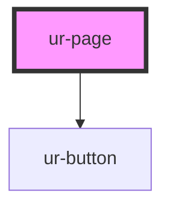

# ur-page

<!-- Auto Generated Below -->

## Properties

| Property            | Attribute             | Description | Type      | Default               |
| ------------------- | --------------------- | ----------- | --------- | --------------------- |
| `followers`         | `followers`           |             | `number`  | `0`                   |
| `pageCover`         | `page-cover`          |             | `any`     | `undefined`           |
| `pageCoverFallback` | `page-cover-fallback` |             | `string`  | `PAGE_COVER_FALLBACK` |
| `pageDescription`   | `page-description`    |             | `any`     | `undefined`           |
| `pageTitle`         | `page-title`          |             | `string`  | `'Page title'`        |
| `showStats`         | `show-stats`          |             | `boolean` | `true`                |

## Events

| Event               | Description | Type               |
| ------------------- | ----------- | ------------------ |
| `pageFollowClicked` |             | `CustomEvent<any>` |

## Dependencies

### Depends on

- [ur-button](../ur-button)

### Graph

----------------------------------------------

*Built with [StencilJS](https://stenciljs.com/)*
