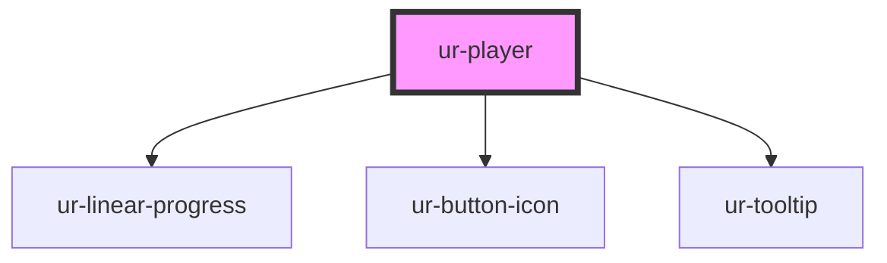

# ur-player

<!-- Auto Generated Below -->

## Properties

| Property       | Attribute       | Description | Type      | Default                                    |
| -------------- | --------------- | ----------- | --------- | ------------------------------------------ |
| `accentColor`  | `accent-color`  |             | `string`  | `'rgb(var(--ur-color-primary-container))'` |
| `author`       | `author`        |             | `string`  | `'Author Name'`                            |
| `autoPlay`     | `auto-play`     |             | `boolean` | `false`                                    |
| `backwardText` | `backward-text` |             | `string`  | `'Back 15s'`                               |
| `chapterName`  | `chapter-name`  |             | `string`  | `'Chapter 1'`                              |
| `coverImage`   | `cover-image`   |             | `string`  | `undefined`                                |
| `darkMode`     | `dark-mode`     |             | `boolean` | `false`                                    |
| `forwardText`  | `forward-text`  |             | `string`  | `'Forward 15s'`                            |
| `pauseText`    | `pause-text`    |             | `string`  | `'Pause'`                                  |
| `playText`     | `play-text`     |             | `string`  | `'Play'`                                   |
| `primaryColor` | `primary-color` |             | `string`  | `'rgb(var(--ur-color-primary))'`           |
| `showControls` | `show-controls` |             | `boolean` | `true`                                     |
| `speedText`    | `speed-text`    |             | `string`  | `'Speed'`                                  |
| `src`          | `src`           |             | `string`  | `undefined`                                |
| `storyTitle`   | `story-title`   |             | `string`  | `'Audiobook Title'`                        |
| `volumeText`   | `volume-text`   |             | `string`  | `'Volume'`                                 |

## Events

| Event                | Description | Type                                                      |
| -------------------- | ----------- | --------------------------------------------------------- |
| `playerEnded`        |             | `CustomEvent<any>`                                        |
| `playerPause`        |             | `CustomEvent<any>`                                        |
| `playerPlay`         |             | `CustomEvent<any>`                                        |
| `playerRateChange`   |             | `CustomEvent<{ rate: number; }>`                          |
| `playerTimeUpdate`   |             | `CustomEvent<{ currentTime: number; duration: number; }>` |
| `playerVolumeChange` |             | `CustomEvent<{ volume: number; }>`                        |

## Methods

### `pause() => Promise<void>`

#### Returns

Type: `Promise<void>`

### `play() => Promise<void>`

#### Returns

Type: `Promise<void>`

### `seekTo(time: number) => Promise<void>`

#### Parameters

| Name   | Type     | Description |
| ------ | -------- | ----------- |
| `time` | `number` |             |

#### Returns

Type: `Promise<void>`

### `setPlaybackRate(rate: number) => Promise<void>`

#### Parameters

| Name   | Type     | Description |
| ------ | -------- | ----------- |
| `rate` | `number` |             |

#### Returns

Type: `Promise<void>`

### `setVolume(value: number) => Promise<void>`

#### Parameters

| Name    | Type     | Description |
| ------- | -------- | ----------- |
| `value` | `number` |             |

#### Returns

Type: `Promise<void>`

### `skipBackward(seconds?: number) => Promise<void>`

#### Parameters

| Name      | Type     | Description |
| --------- | -------- | ----------- |
| `seconds` | `number` |             |

#### Returns

Type: `Promise<void>`

### `skipForward(seconds?: number) => Promise<void>`

#### Parameters

| Name      | Type     | Description |
| --------- | -------- | ----------- |
| `seconds` | `number` |             |

#### Returns

Type: `Promise<void>`

### `togglePlay() => Promise<void>`

#### Returns

Type: `Promise<void>`

## Dependencies

### Depends on

- [ur-linear-progress](../ur-linear-progress)
- [ur-button-icon](../ur-button-icon)
- [ur-tooltip](../ur-tooltip)

### Graph

----------------------------------------------

*Built with [StencilJS](https://stenciljs.com/)*
