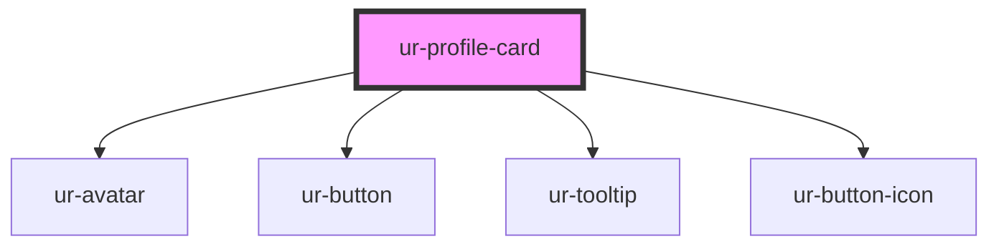

# ur-profile-card

<!-- Auto Generated Below -->

## Properties

| Property                   | Attribute                     | Description | Type               | Default                     |
| -------------------------- | ----------------------------- | ----------- | ------------------ | --------------------------- |
| `avatarAlt`                | `avatar-alt`                  |             | `string`           | `'Avatar'`                  |
| `avatarSize`               | `avatar-size`                 |             | `string`           | `'24px'`                    |
| `avatarSrc`                | `avatar-src`                  |             | `string`           | `undefined`                 |
| `buttonHeight`             | `button-height`               |             | `string`           | `'32px'`                    |
| `buttonWidth`              | `button-width`                |             | `string`           | `'32px'`                    |
| `description`              | `description`                 |             | `string`           | `undefined`                 |
| `followButtonText`         | `follow-button-text`          |             | `string`           | `'Follow'`                  |
| `hideFollowActions`        | `hide-follow-actions`         |             | `boolean`          | `false`                     |
| `initialFollowState`       | `initial-follow-state`        |             | `boolean`          | `false`                     |
| `isOwner`                  | `is-owner`                    |             | `boolean`          | `undefined`                 |
| `memberActionsTooltipText` | `member-actions-tooltip-text` |             | `string`           | `'Remove member from page'` |
| `name`                     | `name`                        |             | `string`           | `undefined`                 |
| `nameFontSize`             | `name-font-size`              |             | `string`           | `'12px'`                    |
| `pageActionsTooltipText`   | `page-actions-tooltip-text`   |             | `string`           | `'Remove page from story'`  |
| `profileType`              | `profile-type`                |             | `"page" \| "user"` | `'user'`                    |
| `showDescription`          | `show-description`            |             | `boolean`          | `false`                     |
| `showMemberActions`        | `show-member-actions`         |             | `boolean`          | `false`                     |
| `showPageActions`          | `show-page-actions`           |             | `boolean`          | `false`                     |
| `unfollowButtonText`       | `unfollow-button-text`        |             | `string`           | `'Following'`               |

## Events

| Event               | Description | Type               |
| ------------------- | ----------- | ------------------ |
| `followEvent`       |             | `CustomEvent<any>` |
| `profileLinkEvent`  |             | `CustomEvent<any>` |
| `removeMemberEvent` |             | `CustomEvent<any>` |
| `removePageEvent`   |             | `CustomEvent<any>` |
| `unfollowEvent`     |             | `CustomEvent<any>` |

## Dependencies

### Depends on

- [ur-avatar](../ur-avatar)
- [ur-button](../ur-button)
- [ur-tooltip](../ur-tooltip)
- [ur-button-icon](../ur-button-icon)

### Graph

----------------------------------------------

*Built with [StencilJS](https://stenciljs.com/)*
