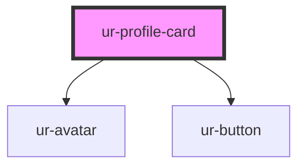

# ur-profile-card

<!-- Auto Generated Below -->

## Properties

| Property             | Attribute              | Description | Type               | Default       |
| -------------------- | ---------------------- | ----------- | ------------------ | ------------- |
| `avatarAlt`          | `avatar-alt`           |             | `string`           | `'Avatar'`    |
| `avatarSize`         | `avatar-size`          |             | `string`           | `'24px'`      |
| `avatarSrc`          | `avatar-src`           |             | `string`           | `undefined`   |
| `buttonHeight`       | `button-height`        |             | `string`           | `'32px'`      |
| `description`        | `description`          |             | `string`           | `undefined`   |
| `followButtonText`   | `follow-button-text`   |             | `string`           | `'Follow'`    |
| `isOwner`            | `is-owner`             |             | `boolean`          | `undefined`   |
| `name`               | `name`                 |             | `string`           | `undefined`   |
| `nameFontSize`       | `name-font-size`       |             | `string`           | `'12px'`      |
| `profileType`        | `profile-type`         |             | `"page" \| "user"` | `'user'`      |
| `showDescription`    | `show-description`     |             | `boolean`          | `false`       |
| `unfollowButtonText` | `unfollow-button-text` |             | `string`           | `'Following'` |

## Events

| Event              | Description | Type                |
| ------------------ | ----------- | ------------------- |
| `followEvent`      |             | `CustomEvent<void>` |
| `profileLinkEvent` |             | `CustomEvent<void>` |
| `unfollowEvent`    |             | `CustomEvent<void>` |

## Dependencies

### Depends on

- [ur-avatar](../ur-avatar)
- [ur-button](../ur-button)

### Graph

----------------------------------------------

*Built with [StencilJS](https://stenciljs.com/)*
