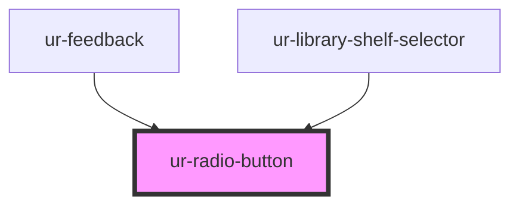

# ur-radio-button

<!-- Auto Generated Below -->

## Properties

| Property   | Attribute  | Description | Type      | Default |
| ---------- | ---------- | ----------- | --------- | ------- |
| `checked`  | `checked`  |             | `boolean` | `false` |
| `disabled` | `disabled` |             | `boolean` | `false` |
| `name`     | `name`     |             | `string`  | `''`    |
| `value`    | `value`    |             | `string`  | `''`    |

## Events

| Event           | Description | Type                              |
| --------------- | ----------- | --------------------------------- |
| `valueSelected` |             | `CustomEvent<{ value: string; }>` |

## Dependencies

### Used by

 - [ur-feedback](../ur-feedback)
 - [ur-library-shelf-selector](../ur-library-shelf-selector)

### Graph

----------------------------------------------

*Built with [StencilJS](https://stenciljs.com/)*
