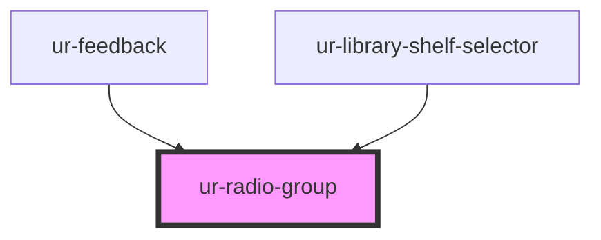

# ur-radio-group

<!-- Auto Generated Below -->

## Properties

| Property   | Attribute  | Description                   | Type      | Default           |
| ---------- | ---------- | ----------------------------- | --------- | ----------------- |
| `name`     | `name`     |                               | `string`  | `'default-group'` |
| `required` | `required` | Whether the group is required | `boolean` | `false`           |
| `value`    | `value`    | The currently selected value  | `string`  | `null`            |

## Events

| Event               | Description                                 | Type                                                               |
| ------------------- | ------------------------------------------- | ------------------------------------------------------------------ |
| `errorStateChanged` | Event emitted when validation state changes | `CustomEvent<{ name: string; error: boolean; message?: string; }>` |
| `valueChanged`      | Event emitted when the value changes        | `CustomEvent<{ name: string; value: string; }>`                    |

## Methods

### `reset() => Promise<void>`

#### Returns

Type: `Promise<void>`

### `validate() => Promise<boolean>`

#### Returns

Type: `Promise<boolean>`

## Dependencies

### Used by

 - [ur-feedback](../ur-feedback)
 - [ur-library-shelf-selector](../ur-library-shelf-selector)

### Graph

----------------------------------------------

*Built with [StencilJS](https://stenciljs.com/)*
