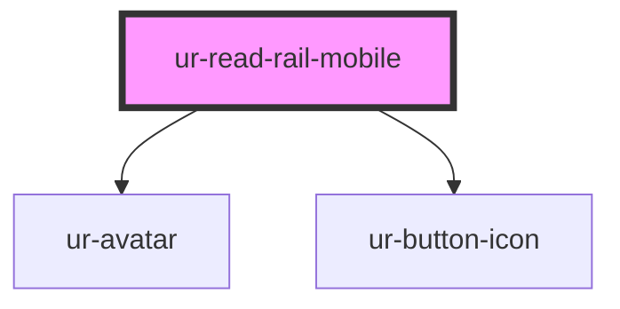

# ur-read-rail-mobile

<!-- Auto Generated Below -->

## Properties

| Property     | Attribute     | Description | Type      | Default                             |
| ------------ | ------------- | ----------- | --------- | ----------------------------------- |
| `avatarName` | `avatar-name` |             | `string`  | `'Jane Doe'`                        |
| `avatarSrc`  | `avatar-src`  |             | `string`  | `'https://i.pravatar.cc/150?img=3'` |
| `comments`   | `comments`    |             | `number`  | `15`                                |
| `dislike`    | `dislike`     |             | `string`  | `'Dislike'`                         |
| `donate`     | `donate`      |             | `string`  | `'Donate'`                          |
| `isFollowed` | `is-followed` |             | `boolean` | `false`                             |
| `isVisible`  | `is-visible`  |             | `boolean` | `true`                              |
| `likes`      | `likes`       |             | `string`  | `'1.5k'`                            |
| `share`      | `share`       |             | `string`  | `'Share'`                           |

## Events

| Event                | Description | Type                   |
| -------------------- | ----------- | ---------------------- |
| `commentClicked`     |             | `CustomEvent<void>`    |
| `dislikeClicked`     |             | `CustomEvent<void>`    |
| `donateClicked`      |             | `CustomEvent<void>`    |
| `followClicked`      |             | `CustomEvent<void>`    |
| `likeClicked`        |             | `CustomEvent<void>`    |
| `shareClicked`       |             | `CustomEvent<void>`    |
| `viewProfileClicked` |             | `CustomEvent<void>`    |
| `visibilityToggled`  |             | `CustomEvent<boolean>` |

## Dependencies

### Depends on

- [ur-avatar](../ur-avatar)
- [ur-button-icon](../ur-button-icon)

### Graph

----------------------------------------------

*Built with [StencilJS](https://stenciljs.com/)*
